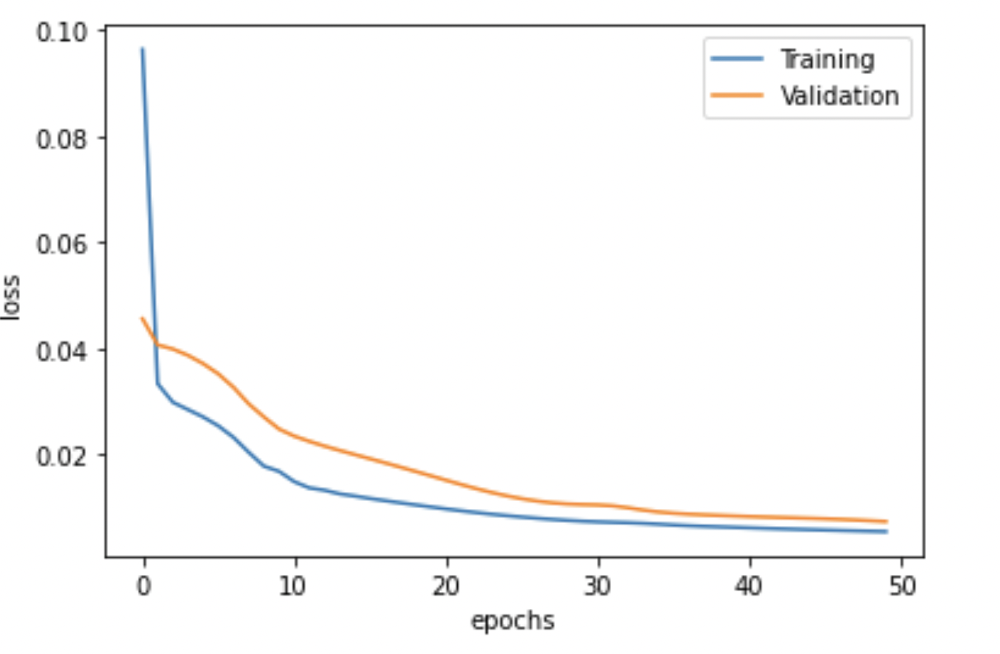

## Forecasting El Nino-Southern Oscillation (ENSO)¶
Univariate Multistep Forecasting
ENSO is one of the most important climate phenomena on Earth due to its ability to change global atmospheric circulation, which influences temperature and precipitation across the globe. It has three states/phases:

El Nino / warm phase: the unusual warm ocean temperatures in the eastern Pacific
La Nina / cool phase: the unusual cool ocean temperatures in the eastern Pacific
Neutral: neither El Nino nor La Nina
Problem
ENSO prediction is one of the most challenging tasks in climatology. It is one of the main drivers of the interannual climate variability of Earth and can cause a wide range of climate anomalies. The impacts include natural disasters (floods, droughts), low & high agriculture yields, price fluctuation, energy demand, availability of water resources, animal movement, and many more.

### Primary Indicators
The primary indicators for ENSO are ONI and MEI.v2. ONI, the preferred indicator by NOAA, is the 3-month average SST anomaly in the Nino 3.4 region. To be considered an El Nino/La Nina event, the SST anomalies in the Nino 3.4 region must meet the following criteria and remain at or above/below these levels for a minimum of five consecutive months.

- El Nino → anomalies at or above +0.5°C
- La Nina → anomalies at or below -0.5°C
- Neutral → anomalies between -0.5°C and +0.5°C

The threshold is further divided into:

- Weak → 0.5 to 0.9 °C SST anomaly
- Moderate → 1.0 to 1.4
- Strong → 1.5 to 1.9
- Very Strong → ≥ 2.0

### Result

